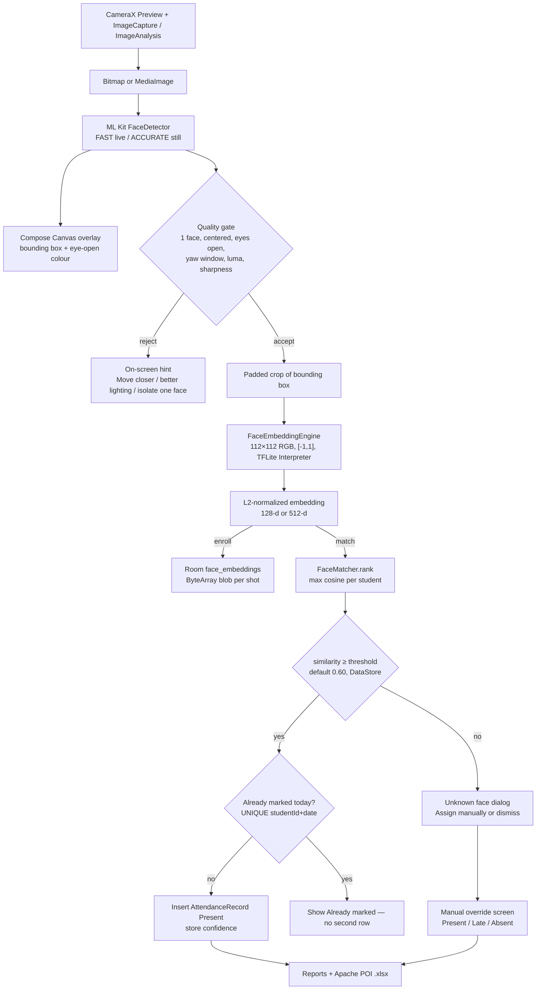

# Architecture

AttendanceFR is a single-module Android app. The structure is **MVVM + Repository**, with **Hilt** as the DI framework (chosen over manual DI so ViewModel factories, the Room singleton, and the TFLite engine stay honest with almost no extra code).

```
┌─────────────────────────────────────────────────────────────┐
│  Compose UI  (screens / camera overlays / navigation)       │
│       ▲  StateFlow / collectAsStateWithLifecycle            │
│       ▼  user events                                        │
│  ViewModels  (@HiltViewModel, viewModelScope + coroutines)  │
│       ▲                                                     │
│       ▼                                                     │
│  Repositories  (Student / Attendance / Class / Settings)    │
│       ▲                                                     │
│       ▼                                                     │
│  Room DAOs  +  DataStore  +  ML helpers  +  Excel / Backup  │
└─────────────────────────────────────────────────────────────┘
```

## Module map

| Layer | Package | Responsibility |
| --- | --- | --- |
| UI | `ui.screens.*`, `ui.camera`, `ui.navigation`, `ui.theme` | Jetpack Compose, CameraX preview, permission gate, navigation |
| ViewModel | same screens package | Orchestrates use-cases, exposes `StateFlow` |
| Domain | `domain.model` | Immutable UI models (`Student`, `MatchResult`, `AttendanceStatus`, …) |
| Data | `data.local`, `data.repository`, `data.prefs`, `data.export`, `data.backup` | Room, DataStore, POI, zip backup |
| ML | `ml` | ML Kit face detection, TFLite embeddings, cosine matcher, lighting/blur |
| DI | `di.AppModule` | Provides Room, DAOs, detector, engine, matcher as singletons |

There is no Retrofit, no WorkManager network, no Firebase.

## End-to-end data flow



ASCII version of the same pipeline:

```
 camera frame
      │
      ▼
 ML Kit FaceDetector  ──► overlay boxes on PreviewView
      │
      ▼
 quality gate (count, size, center, eyes, yaw, luma, blur)
      │ accept
      ▼
 padded crop → resize 112×112 → (pixel/127.5 - 1) → TFLite
      │
      ▼
 L2-normalized embedding
      │
      ├── enrollment: INSERT face_embeddings (3–5 rows / student)
      │
      └── attendance: cosine vs gallery, take MAX per student
               │
               ├── sim ≥ threshold → mark Present (or "already marked")
               └── sim < threshold → Unknown (teacher decides)
```

## Camera → ML Kit → TFLite → Room (attendance)

1. `AttendanceScreen` binds CameraX `Preview` + `ImageAnalysis` + `ImageCapture` to the activity lifecycle. Analysis uses `STRATEGY_KEEP_ONLY_LATEST` and drops frames while ML Kit is busy so a 2021 tablet stays interactive.
2. Live frames go to ML Kit **FAST** mode (classification on, tracking on) purely for the overlay. Recognition is **not** run per frame — that would blow the &lt;1 s budget and drain the battery.
3. On **Capture** (or auto-trigger when a single stable face appears) `ImageCapture` produces a JPEG `ImageProxy`, converted to an upright `Bitmap`.
4. `AttendanceViewModel.capture` hops to `Dispatchers.Default` and:
   - downscales to max side 720
   - runs ML Kit **ACCURATE** still detector
   - applies `FaceDetectorHelper.assessQuality`
   - crops with 25 % padding
   - calls `FaceEmbeddingEngine.embed`
   - asks `FaceMatcher.best` against an in-memory gallery loaded from Room
5. `AttendanceRepository.mark` writes one row per `(studentId, date)`. Automatic repeats are no-ops; a manual override **updates** the existing row and sets `isManual = true`.

Enrollment is the same still path, but `EnrollViewModel` walks a `PoseStep` state machine (straight → left → right → optional chin-up) and only `Save student` commits Room rows.

## Matching strategy

- Embeddings are L2-normalized, so cosine similarity = dot product.
- Each student keeps **every** enrollment shot (typically 3–5). At match time we take the **maximum** similarity across that student's shots, not the mean. One bad enrollment photo therefore cannot drag a good one down.
- Threshold lives in DataStore (`SettingsRepository`), default `0.60f`, clamped to `[0.30, 0.95]`.
- Closest-below-threshold identity is shown as a hint only. It is never written.

## Threading and performance

| Work | Thread |
| --- | --- |
| Compose / CameraX bind | Main |
| ML Kit live detect | CameraX analysis executor (single thread) |
| Still detect + TFLite + cosine | `Dispatchers.Default` |
| Room / DataStore | Room’s query executor / DataStore dispatcher via `suspend` |
| Excel export | ViewModel coroutine (POI is CPU-heavy; called off the UI by `viewModelScope`) |

The TFLite interpreter is a process singleton, created with 4 threads + XNNPACK. Gallery embeddings are cached in the ViewModel so a capture does not re-read SQLite.

## DI graph (Hilt)

`@HiltAndroidApp AttendanceFrApp` → `@AndroidEntryPoint MainActivity` → `@HiltViewModel` screens.

`AppModule` (`SingletonComponent`) provides:

- `AttendanceDatabase` (`Room.databaseBuilder`, destructive migration on version bump — v1 only)
- DAOs
- `FaceDetectorHelper`, `FaceEmbeddingEngine`, `FaceMatcher`

Repositories and `SettingsRepository`, `BackupManager`, `ExcelExporter` are `@Inject @Singleton` constructors.

## Navigation

Bottom bar tabs: Students, Take, Reports, Settings.

Pushed routes (no tab highlight): `enroll?studentId=`, `student/{id}`, `manual?className=`.

## Error / empty / permission policy

Every automatic path has a human path:

| Failure | UI |
| --- | --- |
| Camera permission denied | `CameraPermissionGate` with retry |
| No / multiple faces | Hint, no write |
| Dark / blurry / eyes closed | Hint, no write |
| Model file missing | Banner on Enroll / Take / Settings; capture fails with a clear message, app does not crash |
| Below threshold | Unknown dialog → Manual override |
| Already marked today | Confirmation, no second row |
| Empty student list | EmptyState + Enroll CTA |
| Backup restore | Confirmation dialog, then process restart |

## Why not per-frame recognition?

Running MobileFaceNet on every 30 fps frame on a budget tablet would exceed the thermal and latency budget. Detection (cheap) is live; recognition (TFLite) is on an explicit still. Auto-capture is an optional convenience that still goes through the still path, rate-limited to ~1.6 s.
